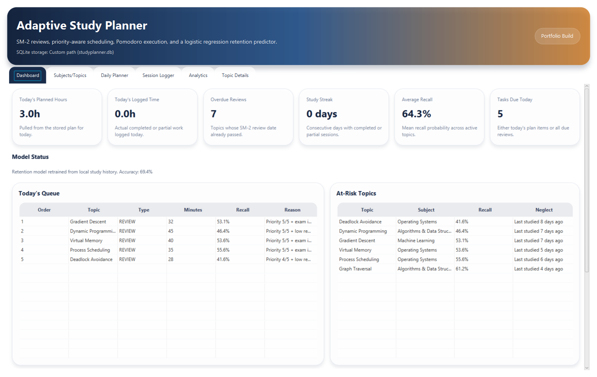
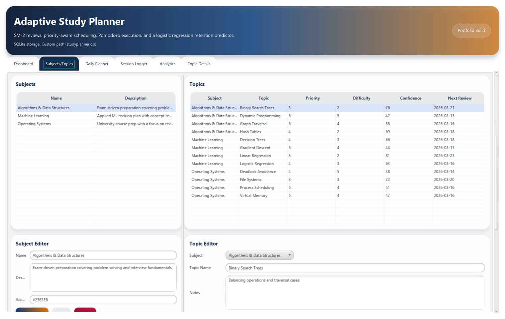
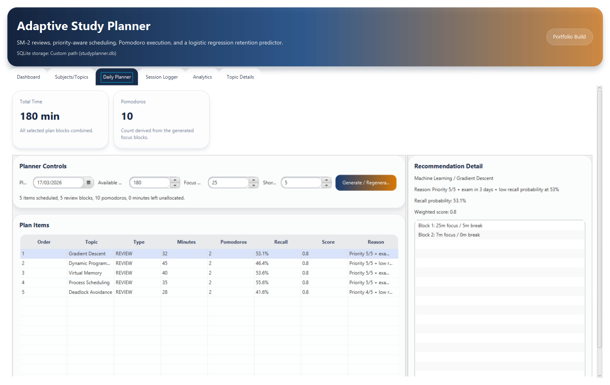
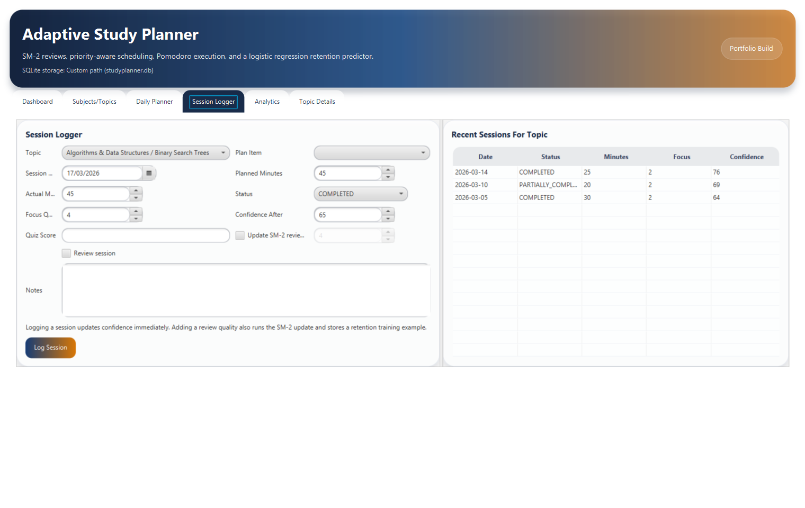
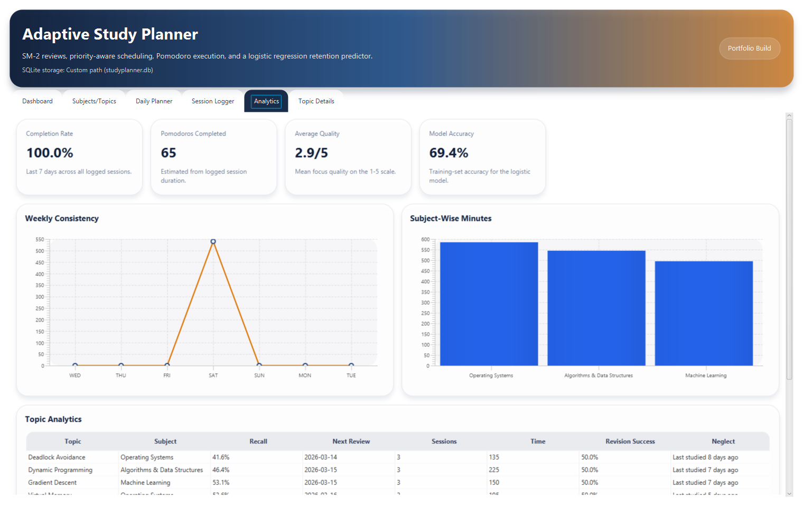
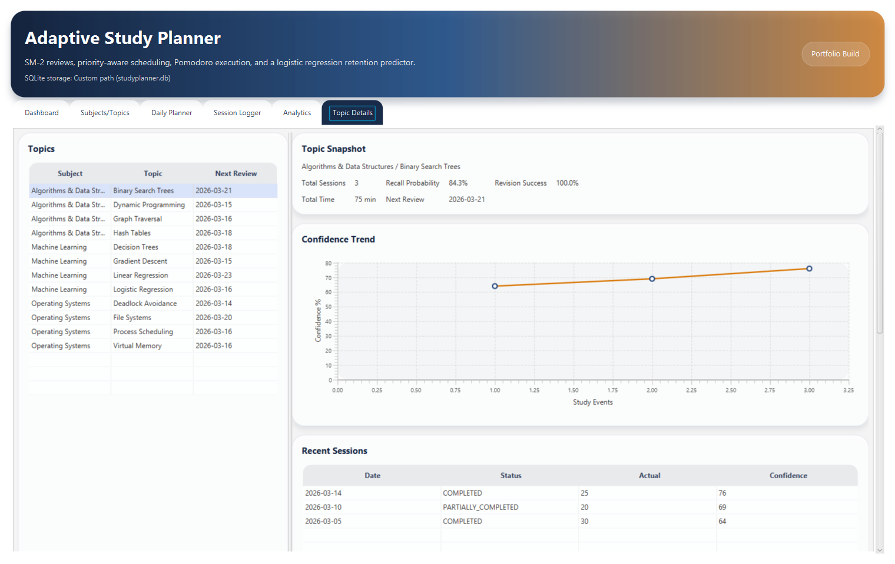

# Adaptive Study Planner & Performance Tracker

Java desktop application for generating adaptive daily study plans, logging execution quality, and predicting topic recall likelihood with a lightweight logistic regression model.

## Motivation

Most study planners stop at static to-do lists. This project treats planning as a feedback loop:

- topics have deadlines, difficulty, confidence, and review state
- study sessions update future scheduling decisions
- retention risk influences revision timing
- analytics make consistency and neglect visible

The application combines planning, review scheduling, execution tracking, and retention prediction in a single desktop workflow.

## Stack

- Java 17
- Maven + Maven Wrapper
- JavaFX
- SQLite
- JUnit 5

## Features

- Subject and topic CRUD with metadata for priority, difficulty, exam date, confidence, estimated time, and review state
- Deterministic daily plan generation using priority, urgency, recall risk, backlog pressure, and available time
- Progress-aware replanning that shortens or skips topics already completed earlier the same day
- SM-2 spaced repetition updates for easiness factor, repetition count, interval, and next review date
- Pomodoro block generation with configurable focus and short-break lengths
- Session logging for completion status, duration, focus quality, confidence, quiz score, and review quality
- Logistic regression retention predictor with bootstrap coefficients and optional local retraining from labeled review / quiz outcomes
- Dashboard and analytics views for streaks, overdue reviews, completion rate, Pomodoros, and topic-level retention
- Seeded demo data with 3 subjects, 12 topics, historical sessions, review records, and model training rows
- Vercel-hosted static project site at the repository root
- Repeatable scripts for screenshot export and Windows desktop packaging

## Product Flow

1. Add subjects and topics with deadlines, difficulty, and confidence.
2. Generate a daily plan for the available minutes.
3. Work through study or review blocks in Pomodoro-sized chunks.
4. Log the session and optionally enter a review quality.
5. The app updates SM-2 review state, stores a labeled retention observation when a review quality or quiz score is present, retrains the retention model when enough labeled outcomes exist, and changes future planning output.
6. If the user regenerates the plan later the same day, previously completed work is taken into account instead of being blindly scheduled again.

## Architecture

Package layout:

```text
src/main/java/com/studyplanner/
  model/
  dto/
  persistence/
  service/
  service/scheduler/
  service/spacedrepetition/
  service/pomodoro/
  ml/
  ui/
  utils/
```

High-level responsibilities:

- `model`: domain entities like `Topic`, `StudySession`, `DailyPlan`, and `ReviewRecord`
- `persistence`: SQLite schema bootstrap, repositories, and demo seeding
- `service`: orchestration for CRUD, session logging, analytics, and retention prediction
- `service/scheduler`: weighted planning engine
- `service/spacedrepetition`: SM-2 implementation
- `service/pomodoro`: focus block generation
- `ml`: custom logistic regression implementation
- `ui`: JavaFX tabs for dashboard, management, planner, logger, analytics, and topic details

## Scheduling Logic

Each topic receives a deterministic weighted score:

```text
score =
  priorityWeight   * priority
  + urgencyWeight  * urgency
  + difficultyWeight * difficulty
  + recallRiskWeight * (1 - recallProbability)
  + backlogWeight * backlog
  + dueReviewBoost (when review is already due)
```

Default weights:

- priority: `0.27`
- urgency: `0.22`
- difficulty: `0.13`
- recall risk: `0.28`
- backlog: `0.10`
- due review boost: `0.08`

Supporting heuristics:

- `urgency` rises as the target exam date approaches
- `backlog` combines overdue review days, inactivity, and incomplete recent sessions
- items with overdue reviews or very low recall probability are converted into `REVIEW` blocks
- same-day logged progress reduces or removes duplicate scheduling during regeneration
- the planner writes recommendation reasons such as:
  `Priority 5/5 + low recall probability at 38% + exam in 5 days`

## SM-2 Spaced Repetition

Review quality is recorded on a `0-5` scale.

- quality `< 3`: repetitions reset, next interval becomes 1 day
- first successful review: 1 day
- second successful review: 6 days
- later successful reviews: `round(previousInterval * easinessFactor)`
- easiness factor is updated with the standard SM-2 formula and clamped to `>= 1.3`

Each review writes a `review_record` row and updates the topic’s:

- easiness factor
- repetition count
- interval days
- next review date

## Logistic Regression Retention Model

The app uses a custom logistic regression model implemented in Java.

Training features:

- days since last revision
- topic difficulty
- previous review quality
- confidence score
- completion consistency
- repetition count
- average session quality

How it is used:

- bootstrap coefficients provide a deterministic estimate from first launch
- only sessions with an objective label (`reviewQuality` or `quizScore`) are added to local training data
- recall probability is displayed in the UI and fed directly into the scheduling score
- once enough labeled outcomes exist, local retraining refines the logistic-regression weights

## Database Schema

SQLite tables created automatically on first run:

- `subjects`
- `topics`
- `study_sessions`
- `review_records`
- `daily_plans`
- `plan_items`
- `pomodoro_blocks`
- `retention_training_data`

The database is created at:

```text
%USERPROFILE%/.adaptive-study-planner/studyplanner.db
```

You can override the location with:

- environment variable: `STUDYPLANNER_DB_PATH`
- JVM property: `-Dstudyplanner.db.path=...`

## UI Screens

- `Dashboard`: today’s planned hours, overdue reviews, streak, average recall, due tasks, risk table, trend charts
- `Subjects/Topics`: CRUD management for study structure and metadata
- `Daily Planner`: generate or regenerate the day’s ordered plan and inspect recommendation reasons
- `Session Logger`: log work done and update SM-2 review state
- `Analytics`: weekly consistency, completion rate, Pomodoros, subject breakdown, and topic metrics
- `Topic Details`: confidence trend, session history, review history, recall probability, and next review date

## Demo Data

The first launch seeds the app with:

- 3 subjects
- 12 topics
- varied deadlines, priorities, difficulties, and confidence levels
- historical study sessions
- review records
- retention model training data

That makes the planner, dashboard, and analytics immediately usable without manual setup.

## Running Locally

### Requirements

- JDK 17

### Run

Windows:

```bash
mvnw.cmd javafx:run
```

macOS / Linux:

```bash
./mvnw javafx:run
```

### Build

```bash
./mvnw -DskipTests package
```

### Test

```bash
./mvnw test
```

### Refresh Screenshots

Windows:

```bash
powershell -ExecutionPolicy Bypass -File scripts/export-screenshots.ps1
```

This generates fresh screenshots in `docs/screenshots/` using a temporary seeded SQLite database.

### Package The Windows App

Windows:

```bash
powershell -ExecutionPolicy Bypass -File scripts/package-windows.ps1
```

This produces:

- `dist/AdaptiveStudyPlanner/` app image
- `dist/AdaptiveStudyPlanner-windows-x64.zip` downloadable archive

## Vercel Project Site

This repository now includes a static project site at the repo root:

- `index.html`
- `site.css`
- `vercel.json`

Recommended public setup:

1. Deploy the static site on Vercel to publish the product overview, screenshots, and links.
2. Keep the JavaFX app as the downloadable or locally runnable product.
3. Publish the packaged Windows zip on GitHub Releases.

Deployment status:

- The repository is Vercel-ready.
- A live Vercel URL still requires an authenticated Vercel account or token at deploy time.
- The JavaFX desktop application itself is not the part you deploy to Vercel.

See `docs/vercel-deployment.md` for the exact deployment flow.

## Public Links

- Live site: `https://adaptive-study-planner-performance.vercel.app/`
- GitHub repository: `https://github.com/archeearjun/adaptive-study-planner-performance-tracker`
- GitHub release page: `https://github.com/archeearjun/adaptive-study-planner-performance-tracker/releases/tag/v1.0.0`
- Direct Windows download: `https://github.com/archeearjun/adaptive-study-planner-performance-tracker/releases/download/v1.0.0/AdaptiveStudyPlanner-windows-x64.zip`
- Resume entry: `docs/resume-entry.md`
- LinkedIn copy: `docs/linkedin-post-template.md`

## Developer

- LinkedIn: `https://www.linkedin.com/in/archeearjun`
- GitHub profile: `https://github.com/archeearjun/`
- Email: `archeearjunwork@gmail.com`
- Phone: `+91 88394 79877`

## Screenshots








## Highlights

- Built a Java-based study planning engine combining SM-2 spaced repetition, priority-weighted scheduling, and Pomodoro-based focus sessions
- Integrated a logistic regression retention model with bootstrap priors and local retraining from labeled review / quiz outcomes to influence revision timing
- Added analytics for study consistency, overdue reviews, session quality, and topic-level retention trends using JavaFX + SQLite

## Tests Included

- SM-2 review update behavior
- logistic regression training behavior
- scheduler integration with seeded SQLite data
- adaptive replanning after work is already completed on the same day

## Future Improvements

- export analytics and plans to CSV or PDF
- add a signed native installer in addition to the zipped app image
- add dark theme and richer chart interactivity
- support multiple user profiles
- tune scheduling weights from observed completion outcomes
- add calendar views and exam-week planning presets
